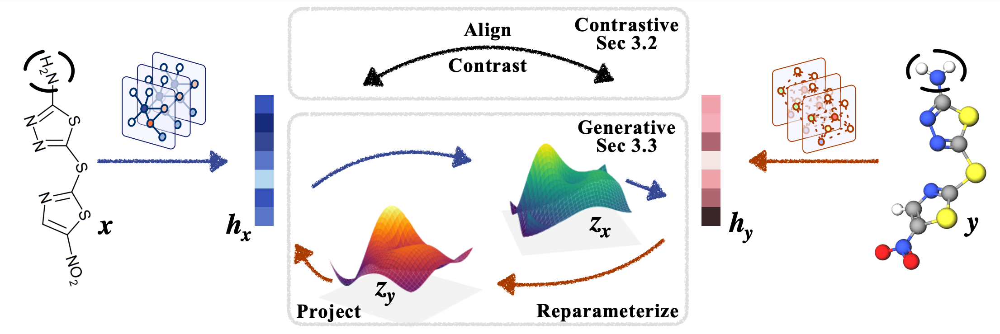
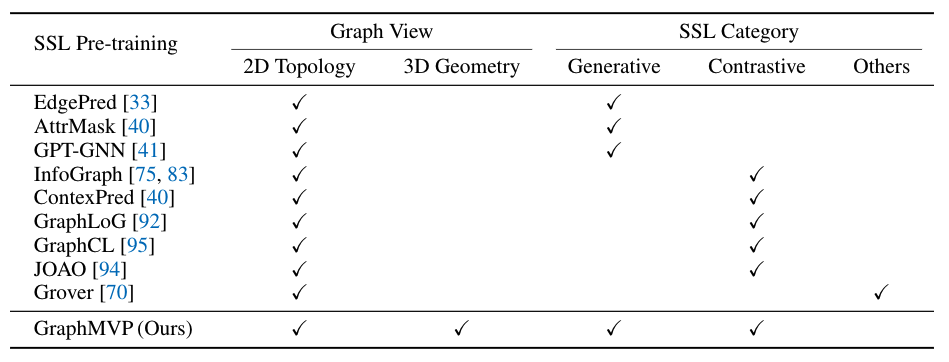

# Pre-training Molecular Graph Representation with 3D Geometry

**ICLR 2022**

Authors: Shengchao Liu, Hanchen Wang, Weiyang Liu, Joan Lasenby, Hongyu Guo, Jian Tang

[[Project Page](https://chao1224.github.io/GraphMVP)]
[[Paper](https://openreview.net/forum?id=xQUe1pOKPam)]
[[ArXiv](https://arxiv.org/abs/2110.07728)]
[[Slides](https://drive.google.com/file/d/1-lDWtdgeEgTO009YVPzHK8f7yYbvQ1oY/view?usp=sharing)]
[[Poster](https://drive.google.com/file/d/1L_XrlgfmCmycfGf47Dt6nnaKpZtiqiN-/view?usp=sharing)]
<br>
[[NeurIPS SSL Workshop 2021](https://sslneurips21.github.io/)]
[[ICLR GTRL Workshop 2022 (Spotlight)](https://gt-rl.github.io/)]

This repository provides the source code for the ICLR'22 paper **Pre-training Molecular Graph Representation with 3D Geometry**, with the following task:
- During pre-training, we consider both the 2D topology and 3D geometry.
- During downstream, we consider tasks with 2D topology only.

In the future, we will merge it into the [TorchDrug](https://github.com/DeepGraphLearning/torchdrug) package.

<p align="center">
   
</p>

## Baselines
For implementation, this repository also provides the following graph SSL baselines:
- Generative Graph SSL:
  - [Edge Prediction (EdgePred)](https://proceedings.neurips.cc/paper/2017/file/5dd9db5e033da9c6fb5ba83c7a7ebea9-Paper.pdf)
  - [AttributeMasking (AttrMask)](https://openreview.net/forum?id=HJlWWJSFDH)
  - [GPT-GNN](https://arxiv.org/abs/2006.15437)
- Contrastive Graph SSL:
  - [InfoGraph](https://openreview.net/pdf?id=r1lfF2NYvH)
  - [Context Prediction (ContextPred)](https://openreview.net/forum?id=HJlWWJSFDH)
  - [GraphLoG](http://proceedings.mlr.press/v139/xu21g/xu21g.pdf)
  - [Grover-Contextual](https://papers.nips.cc/paper/2020/hash/94aef38441efa3380a3bed3faf1f9d5d-Abstract.html)
  - [GraphCL](https://papers.nips.cc/paper/2020/file/3fe230348e9a12c13120749e3f9fa4cd-Paper.pdf)
  - [JOAO](https://arxiv.org/abs/2106.07594)
- Predictive Graph SSL:
  - [Grover-Motif](https://papers.nips.cc/paper/2020/hash/94aef38441efa3380a3bed3faf1f9d5d-Abstract.html)

<p align="center">
   
</p>

## Environments
Install packages under conda env
```bash
conda create -n GraphMVP python=3.7
conda activate GraphMVP

conda install -y -c rdkit rdkit
conda install -y -c pytorch pytorch=1.9.1
conda install -y numpy networkx scikit-learn
pip install ase
pip install git+https://github.com/bp-kelley/descriptastorus
pip install ogb
export TORCH=1.9.0
export CUDA=cu102  # cu102, cu110

wget https://data.pyg.org/whl/torch-${TORCH}%2B${CUDA}/torch_cluster-1.5.9-cp37-cp37m-linux_x86_64.whl
pip install torch_cluster-1.5.9-cp37-cp37m-linux_x86_64.whl
wget https://data.pyg.org/whl/torch-${TORCH}%2B${CUDA}/torch_scatter-2.0.9-cp37-cp37m-linux_x86_64.whl
pip install torch_scatter-2.0.9-cp37-cp37m-linux_x86_64.whl
wget https://data.pyg.org/whl/torch-${TORCH}%2B${CUDA}/torch_sparse-0.6.12-cp37-cp37m-linux_x86_64.whl
pip install torch_sparse-0.6.12-cp37-cp37m-linux_x86_64.whl
pip install torch-geometric==1.7.2
```

## Dataset Preprocessing

For dataset download, please follow the instruction [here](https://github.com/chao1224/GraphMVP/tree/main/datasets).

For data preprocessing (GEOM), please use the following commands:
```
cd src_classification
python GEOM_dataset_preparation.py --n_mol 50000 --n_conf 5 --n_upper 1000 --data_folder $SLURM_TMPDIR
cd ..

cd src_regression
python GEOM_dataset_preparation.py --n_mol 50000 --n_conf 5 --n_upper 1000 --data_folder $SLURM_TMPDIR
cd ..

mv $SLURM_TMPDIR/GEOM datasets
```

**Featurization**. We employ two sets of featurization methods on atoms.
1. For classification tasks, in order to follow the main molecular graph SSL research line, we use the same atom featurization methods (consider the atom types and chirality).
2. For regression tasks, results with the above two atom-level features are too bad. Thus, we consider more comprehensive features from OGB.

## Experiments

### Terminology specification

In the latest scripts, we use `GraphMVP` for the trivial GraphMVP (Eq. 7 in the paper), and `GraphMVP_hybrid` includes two variants adding extra 2D SSL pretext tasks (Eq 8. in the paper).
In the previous scripts, we call these two terms as `3D_hybrid_02_masking` and `3D_hybrid_03_masking` respectively.
This could show up in some pre-trained log files [here](https://drive.google.com/drive/folders/1uPsBiQF3bfeCAXSDd4JfyXiTh-qxYfu6?usp=sharing).

| GraphMVP | Latest scripts | Previous scripts |
| :--: | :--: | :--: |
| Eq. 7 | `GraphMVP` | `3D_hybrid_02_masking` |
| Eq. 8 | `GraphMVP_hybrid` | `3D_hybrid_03_masking` |

### For GraphMVP pre-training

Check the following scripts:
- `scripts_classification/submit_pre_training_GraphMVP.sh`
- `scripts_classification/submit_pre_training_GraphMVP_hybrid.sh`
- `scripts_regression/submit_pre_training_GraphMVP.sh`
- `scripts_regression/submit_pre_training_GraphMVP_hybrid.sh`

The pre-trained model weights, training logs, and prediction files can be found [here](https://drive.google.com/drive/folders/1uPsBiQF3bfeCAXSDd4JfyXiTh-qxYfu6?usp=sharing).

### For Other SSL pre-training baselines

Check the following scripts:
- `scripts_classification/submit_pre_training_baselines.sh`
- `scripts_regression/submit_pre_training_baselines.sh`

### For Downstream tasks

Check the following scripts:
- `scripts_classification/submit_fine_tuning.sh`
- `scripts_regression/submit_fine_tuning.sh`

## Cite Us

Feel free to cite this work if you find it useful to you!

```
@inproceedings{liu2022pretraining,
    title={Pre-training Molecular Graph Representation with 3D Geometry},
    author={Shengchao Liu and Hanchen Wang and Weiyang Liu and Joan Lasenby and Hongyu Guo and Jian Tang},
    booktitle={International Conference on Learning Representations},
    year={2022},
    url={https://openreview.net/forum?id=xQUe1pOKPam}
}
```
